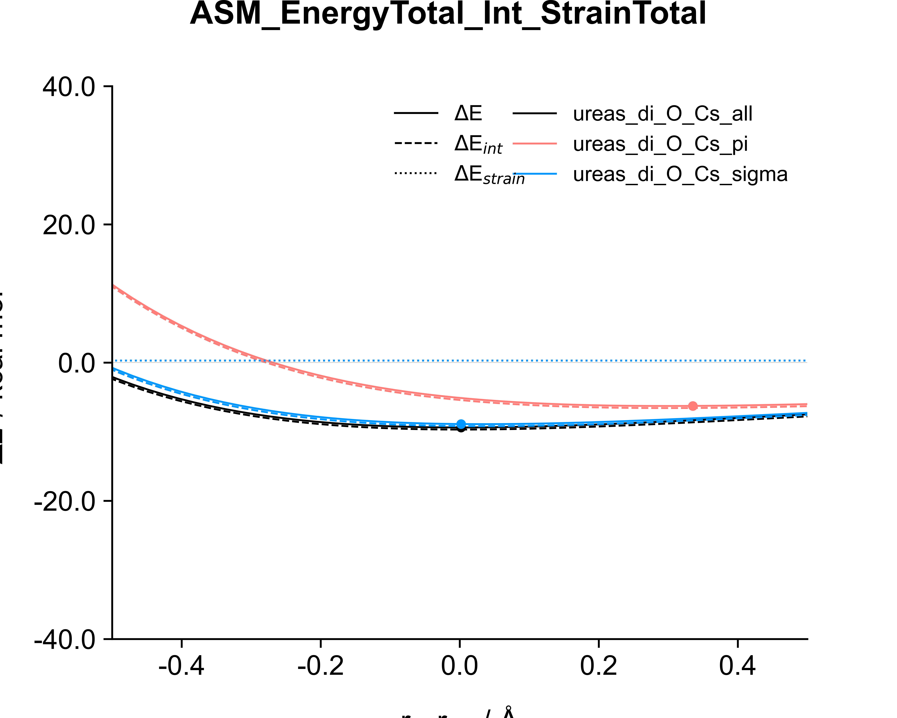
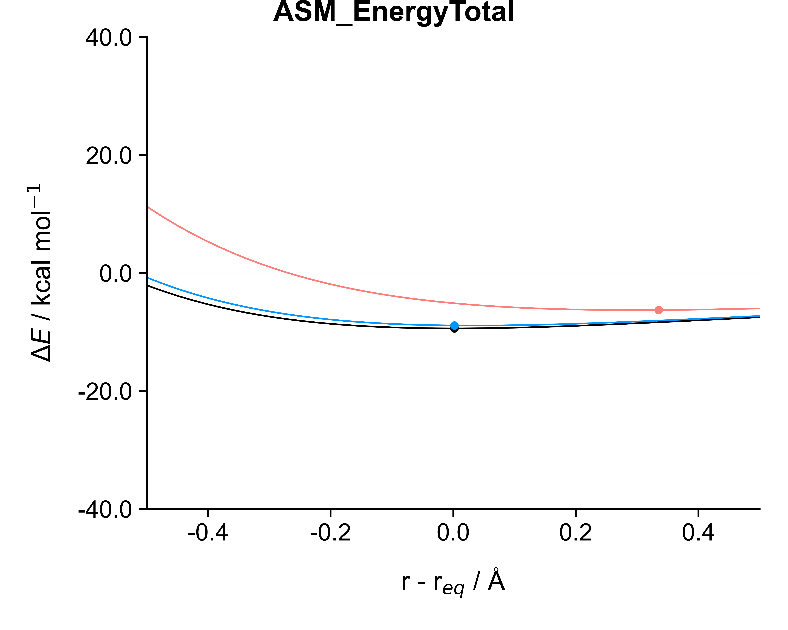
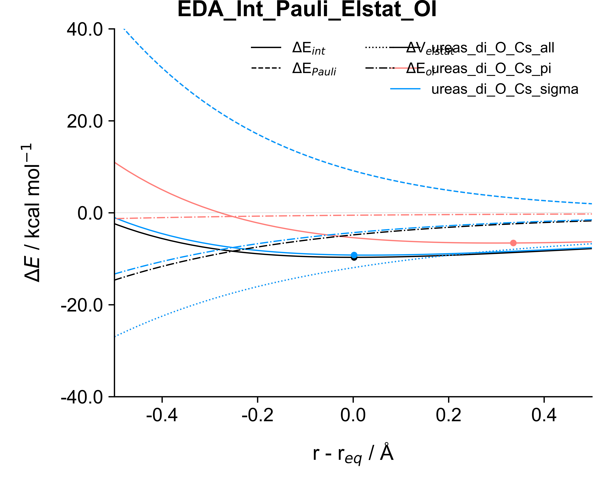

.. _Usage:

Usage
======

pyfrag_plotter is a Python package that can be used to make plots from PyFrag directories containing the .txt (resultsfile wth the large table) and .in file (inputfile).

PyFrag is a program that can be used to analyze reaction coordinates of reactions by applying the Activation Strain Model and Energy Decomposition Analysis methods.

To use pyfragplotter, you need to have a config file and call the |init| function. The config file should contain the necessary information about the PyFrag directories and the plot settings. The function reads the config file and sets up the necessary variables for making the plots. The configuration options are specified in the `config.ini` file. See :doc:`../../pyfrag_plotter/config/config.ini` for more information.

Note that you can customize the plot settings in the config file, such as the plot type, color scheme, y limits of the graph, axis labels and many more.

Here's an example of how to initialize the program:

.. code-block:: python

    from pyfrag_plotter import initialize_pyfrag_plotter

    initialize_pyfrag_plotter('path_to_config_file')

Creating the PyFragResultsObject
=============================

Now that we have initialized the program, we can read the files (.txt and .in) that are present in the pyfag directory. The most straightforward method is to use the |obj_from_dir| function that loads the files, processes these (e.g. removing Dispersion term if zero everywhere, trim data, remove outliers, and more)

Note: here we assume that you already have specified the paths to the PyFrag directories in your code.

.. code-block:: python

    objs = [create_pyfrag_object_from_dir(pyfrag_dir) for pyfrag_dir in pyfrag_dirs]
    
Creating a Plotter instance
===========================

The next step is to convert the |results_object| to a Plotter instance. The latter is able to plot the data contained in the PyFragResultsObject. This is done by passing the PyFragResultsObject to the Plotter class. The Plotter class contains methods such as `plot_asm`, `plot_eda`, and more to make plots.

.. code-block:: python

    plot_inst = Plotter(name="example_plots", plot_dir=plot_dir, pyfrag_objects=objs, irc_coord=("bondlength_1",  "r - r$_{eq}$ / Å"))

Generating Plots
================

Plots can now be made using |plotter|. Let's try to call the `plot_asm()` fumction. This function makes a plot of the Activation Strain Model (ASM) results. The plot is saved in the directory specified in the config file.

.. code-block:: python

    plot_inst.plot_asm()

We can furthermore specify specific format options as keyword arguments. See |ax_details| and |fig_details| for available options.

See what this does:

.. code-block:: python

    with plot_inst as inst:
        inst.plot_asm(y_lim=[-20, 20], tight_layout=False)

Example Plots and further information
=====================================

Here are example images:

- ASM plot with `tight_layout` enabled and `y_lim` set to [-20, 20]

- ASM plot with only the EnergyTotal term (with `inst.plot_asm(keys=["EnergyTotal"]))

- EDA plot with all keys (with `inst.plot_eda()`)

For more examples, `visit the example folder <https://github.com/SiebeLeDe/pyfrag_plot/tree/main/example>`_.
